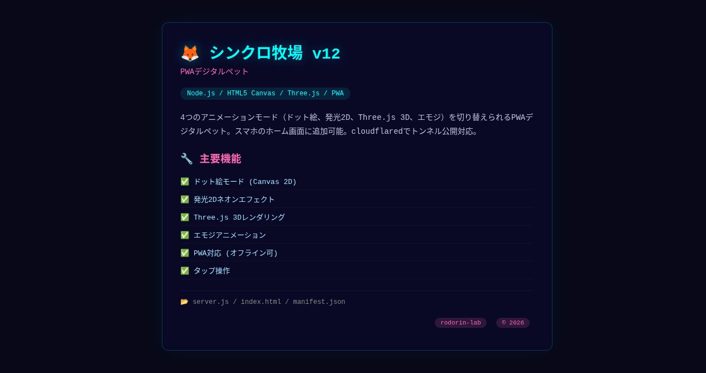

# 🦊 シンクロ牧場 v12 — PWAデジタルペット

 

ロドリンお兄ちゃんとシンクロ（グラム）が作った **PWAデジタルペット** だよ！🛸💖

## ✨ 特徴

## 📸 スクリーンショット



- 🎨 **4アニメーションモード**
  - ドット絵（Canvas 2D）
  - 発光2D（ネオンエフェクト）
  - Three.js 3D（リアルタイム3Dレンダリング）
  - エモジ（かわいい絵文字アニメ）
- 📱 **PWA対応** — スマホのホーム画面に追加可能！
- 🌐 **cloudflared** でトンネル公開可能
- 🎮 インタラクティブ — タップでリアクション

## 🚀 起動方法

```bash
cd digital-pet
node server.js
# http://localhost:3333 でアクセス
```

cloudflaredで公開する場合：
```bash
cloudflared tunnel --url http://localhost:3333
```

## 🛠 技術スタック

- Node.js (サーバー)
- HTML5 Canvas (ドット絵モード)
- Three.js (3Dモード)
- PWA Manifest + Service Worker

## 📝 作者

- **ロドリン** & **シンクロ（グラム）** 💎🛸
- rodorin-lab © 2026
